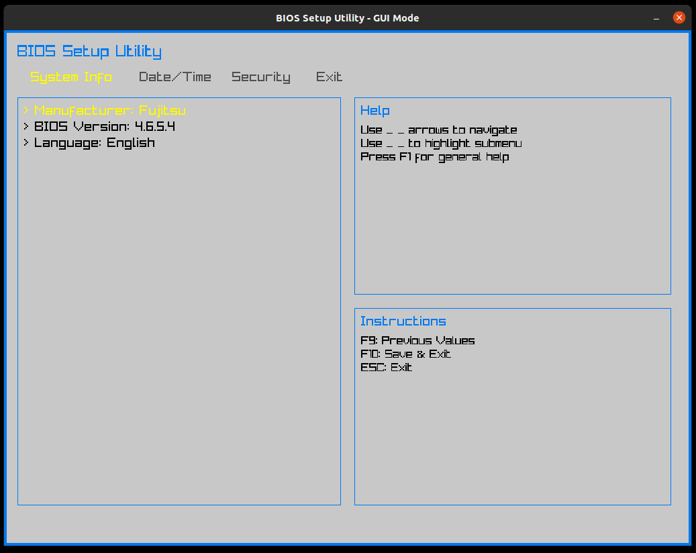

# bios-like-tui-gui

RUST based GUI and TUI for example BIOS-like UI pattern.

## Motivation

I needed desktop specific application interface UI for my project, when in one code base I can run program on both: X11 and terminal.
This is situation, when RUST language came. We've great RATATUI and RAYLIB libraries to delivery this.
BIOS app. was random choice, but useful in my private OS dev. practice ;-)

Maybe someone would like to create simulation or game or tool with that code - feel free to reuse, this is Open Source ;-)

## How it looks like?

### TUI version


### GUI version



## How to run?

### TUI version

```bash
cargo run
```

### GUI version

```bash
cargo run -- gui
```

